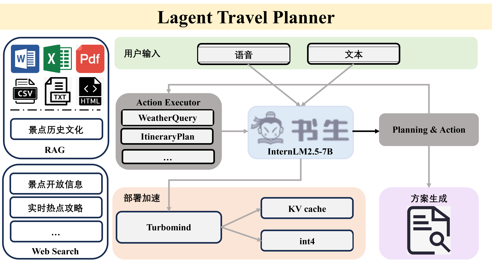

基于InternLM实现的智能旅行规划小助手

https://github.com/InternLM/Tutorial



# 💡开发进度💡
- [x] ☀天气查询
- [x] 🧭路线规划
- [x] 🎤ASR语音输入
- [ ] 🔥实时热点攻略
- [ ] 🏛景点开放信息

# ⭐使用说明⭐

## 环境配置
``pip install -r requirements.txt``

## ASR模型下载
运行``/root/lizhenyu/LLM_repo/requirements/asr/models_download.sh``

## 模型部署
```sh
conda activate agent
# 启用ASR
uvicorn server.asr.asr_server:app --host 0.0.0.0 --port 8003

# 部署模型
lmdeploy serve api_server /root/share/new_models/Shanghai_AI_Laboratory/internlm2_5-7b-chat --model-name internlm2_5-7b-chat \
    --model-format hf \
    --quant-policy 4 \
    --cache-max-entry-count 0.4\

# 启动UI
export WEATHER_API_KEY={$和风天气API}
export ITINERARY_API_KEY={$高德地图API}
streamlit run /root/lizhenyu/LLM_repo/app.py
```